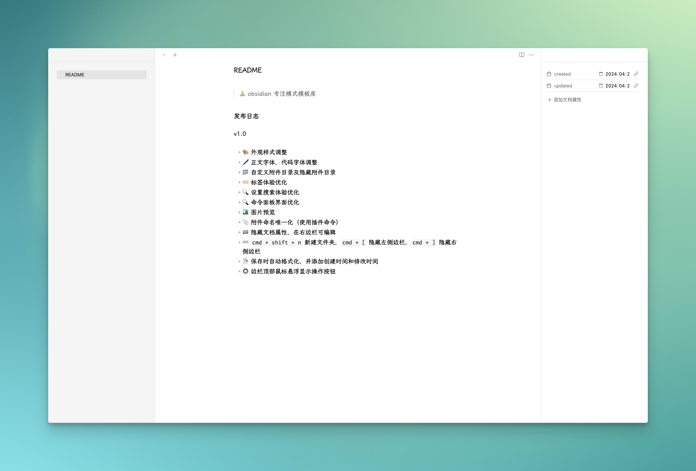
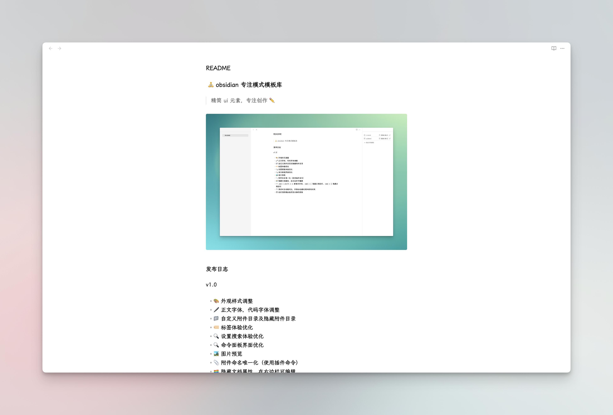
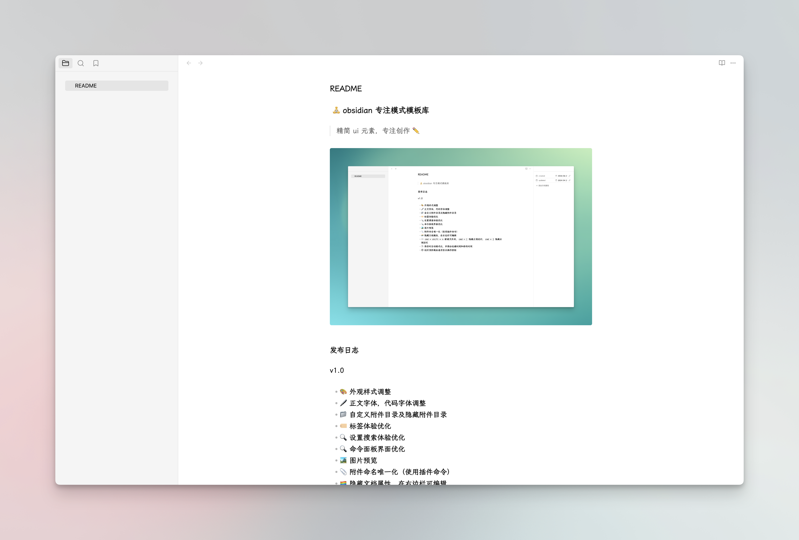
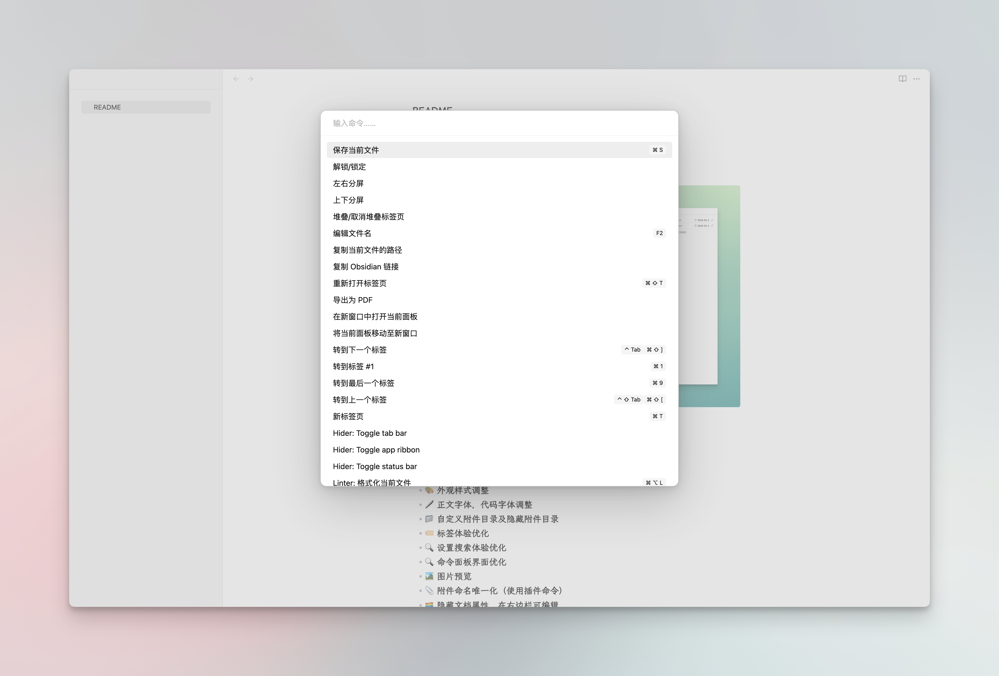

#  🧘 obsidian 专注模式模板库

  

> 精简 ui 元素，专注创作 ✏️

## 发布日志

v1.0

- 🎨 外观样式调整
- 🖊️ [正文字体](https://github.com/lxgw/LxgwWenKai-Screen)，[代码字体](https://github.com/tonsky/FiraCode)调整
- 📁 [自定义附件目录](https://github.com/RainCat1998/obsidian-custom-attachment-location)及[隐藏附件目录](https://github.com/JonasDoesThings/obsidian-hide-folders)
- 🏷️ [标签](https://github.com/pjeby/tag-wrangler)体验优化
- 🔍 [设置搜索](https://github.com/javalent/settings-search)体验优化
- 🔍 [命令面板](https://github.com/AlexBieg/obsidian-better-command-palette)界面优化
- 🏞️ [图片预览](https://github.com/sissilab/obsidian-image-toolkit)
- 📎 [附件命名唯一化](https://github.com/dy-sh/obsidian-unique-attachments)（使用插件命令）
- 🏳️‍🌈 隐藏文档属性，在右边栏可编辑
- ⌨️ `cmd + shift + n` [新建文件夹](https://github.com/Taitava/obsidian-shellcommands)，`cmd + [` 隐藏左侧边栏，`cmd + ]` 隐藏右侧边栏
- 📄 保存时[自动格式化](https://github.com/platers/obsidian-linter)，并添加创建时间和修改时间
- 🔘 边栏顶部鼠标悬浮显示操作按钮
