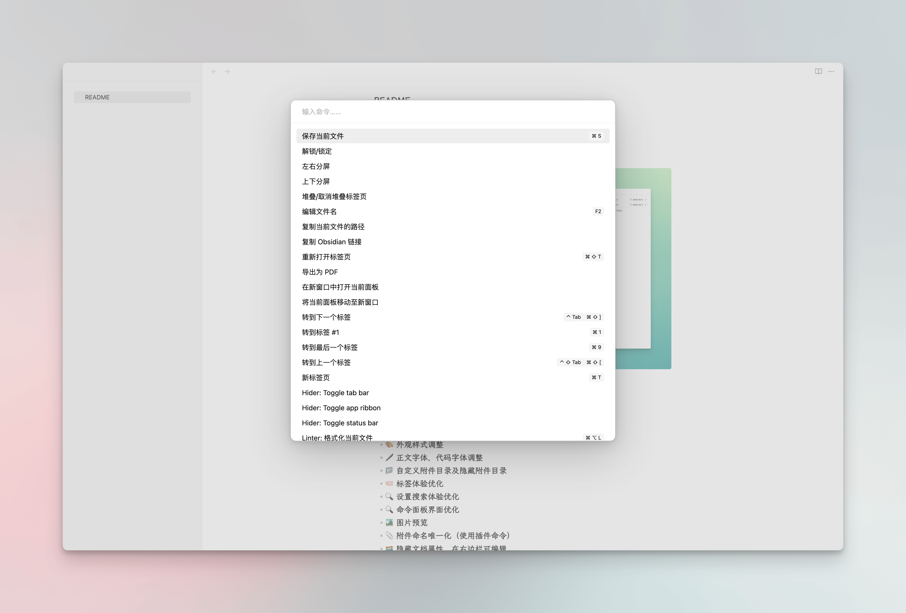

#  🧘 obsidian 专注模式模板库

> 精简 ui 元素，专注创作 ✏️

## 发布日志

v1.0

- 🎨 外观样式调整
- 🖊️ 正文字体，代码字体调整
- 📁 自定义附件目录及隐藏附件目录
- 🏷️ 标签体验优化
- 🔍 设置搜索体验优化
- 🔍 命令面板界面优化
- 🏞️ 图片预览
- 📎 附件命名唯一化（使用插件命令）
- 🏳️‍🌈 隐藏文档属性，在右边栏可编辑
- ⌨️ `cmd + shift + n` 新建文件夹，`cmd + [` 隐藏左侧边栏，`cmd + ]` 隐藏右侧边栏
- 📄 保存时自动格式化，并添加创建时间和修改时间
- 🔘 边栏顶部鼠标悬浮显示操作按钮
